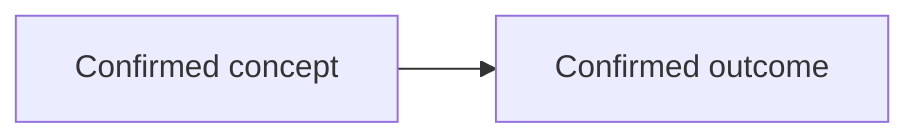

# Mermaid図

このDirectoryにはRepositoryでReviewする正式な設計図を置く。図の正本形式、Project Ownerのdraw.io入力との境界、承認手順は[図の管理ルール](../engineering/diagram-governance.md)に従う。

## Template

新しい図は`<kebab-case-name>.mermaid.md`として作成する。

````markdown
# Diagram Title

- Status: Confirmed
- Source of Truth: Repository Mermaid
- Related: GitHub IssueまたはADRのURL
- Last Confirmed: YYYY-MM-DD


````

`Confirmed`だけを図へ含める。`Proposed`と`Open Question`は関連Issueへ記録し、Project Ownerが採用を承認した後に更新する。
