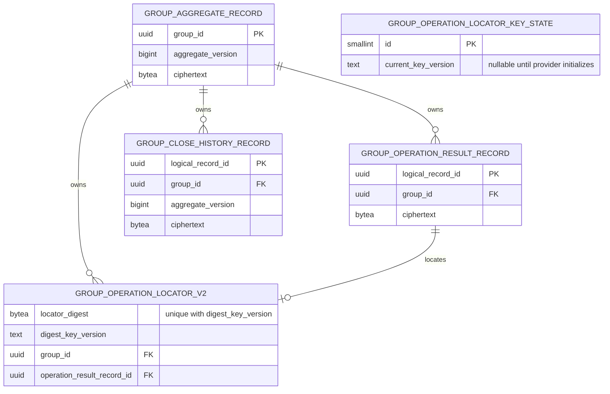

# Group Management locator v2の保存関係

- Status: Confirmed（ADR #55／#73／#85で採用した保存境界）
- Source of Truth: [operation locator／Group ID Decision](../adr/group-operation-locator-and-group-id-contract.md)、[v2 Migration](../../apps/api/migrations/group-management/0002_group_locator_v2.sql)
- Related: [Task #42](https://github.com/takeshi-arihori/kakei_app/issues/42)、[Task #94](https://github.com/takeshi-arihori/kakei_app/issues/94)、[Task #95](https://github.com/takeshi-arihori/kakei_app/issues/95)、[Task #96](https://github.com/takeshi-arihori/kakei_app/issues/96)
- Last Confirmed: 2026-09-23

## 図の目的

v2 locatorと暗号化済みoperation結果、Group close不変履歴のFK関係を示す。列、制約、Migration順序の完全な正本はSQLであり、文章のAccepted Decisionをこの図より優先する。`group_operation_locator_key_state`はFKではなくtransaction lockの共有対象なので関係線で結ばない。

v1 locator表は旧digestを復元・再key化せず、0件preflight後も削除しない。v2 locatorの`locator_digest`と`digest_key_version`の組が一意であり、random `group_id`とoperation結果へのFKはGroup削除時にcascadeする。Key-state行は#96のcommandが`FOR SHARE`、rotationが`FOR UPDATE`で固定する。Group closeの内容は保護Recordのciphertext内に置き、平文列を追加しない。
