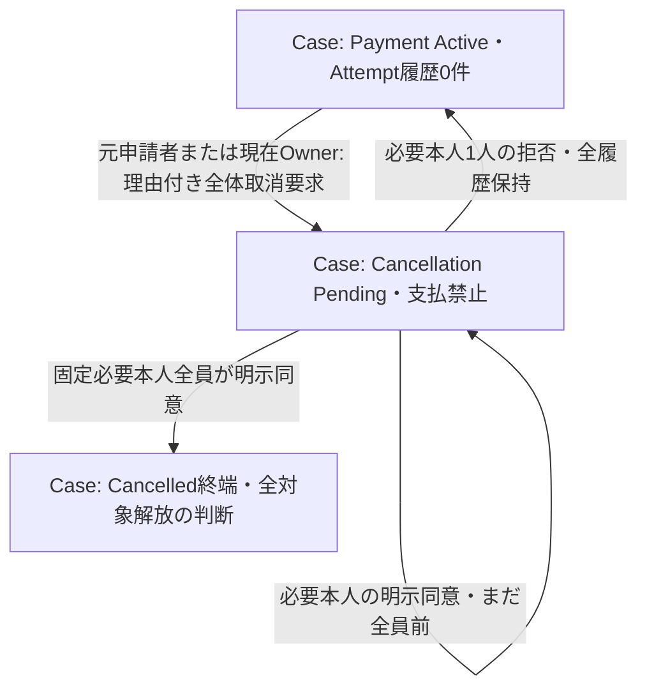

# 支払開始前の全体取消Lifecycle

- Status: Confirmed（取消部分のみ、実予約解放とApplication保存は省略）
- Source of Truth: [現行モデル 全体取消](../product/current-model.md)、[ADR #152 Case Root](../adr/expense-settlement-consistency-boundary.md)
- Related: [Task #166](https://github.com/takeshi-arihori/kakei_app/issues/166)、[内部契約](../domain/settlement-cancellation-contract.md)、[支払図](settlement-payment-lifecycle.mermaid.md)
- Last Confirmed: 2026-10-02

通常Approvalの自己承認を取消同意に流用しない。net 0の必要者も含め固定集合全件の明示同意を要する。拒否後は同じ指示を再有効化し、新要求は新IDで旧履歴を残す。Reported／Returned／ReceivedのいずれかのAttempt履歴があれば要求不可。Archivedの全0精算も取消不可。

CancelledはArchivedと区別し、内容・判断・指示・全対象を保持した終端となる。実対象解放とCase更新を同じatomic commitで保存する責務、本人性・Group fence・先着CASは後続Application／Adapter契約。Domain遷移だけで保存成功や予約解放済みとは扱わない。Groupは自動終了しない。
