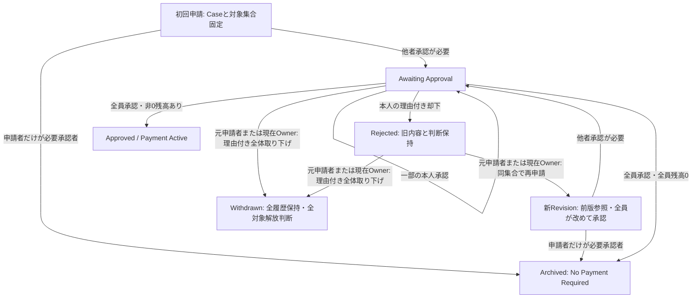

# 精算Caseのpre-payment Revision Lifecycle

- Status: Confirmed（再申請・取り下げまで。支払・取消は省略）
- Source of Truth: [現行モデル Approval・Revision／Withdraw](../product/current-model.md)、[ADR #152 Case Root](../adr/expense-settlement-consistency-boundary.md)
- Related: [Task #162](https://github.com/takeshi-arihori/kakei_app/issues/162)、[内部契約](../domain/settlement-case-revision-contract.md)、[初回図](settlement-initial-approval.mermaid.md)
- Last Confirmed: 2026-10-01

Caseの対象集合と元申請者は最初から不変。各申請でContentと必要承認者を固定し、旧版の承認は新版へ引き継がない。新版は前版IDを参照し、旧内容・判断・却下理由を保持する。

矢印のOwner／本人はConfirmed業務資格を表し、具体認可PortやSource取得・lockは描かない。Domain入力はtrusted factsであり、生ClientのOwner申告を証拠にしない。全対象解放判断を、Adapterによる予約解放済みと扱わない。予約／Case更新の実原子性はADR152の後続commit契約で検証する。

WithdrawnはCaseの終端で同Caseを再開・再申請しない。取り下げでも最新Revisionを承認済みにせず、既存の判断状態を保持する。Rejected／Payment Activeからの後続業務を全て描いた図ではない。Payment Attempt／受取確認／差し戻し／取消／完了Archiveは後続Taskであり、部分図の外にある。
