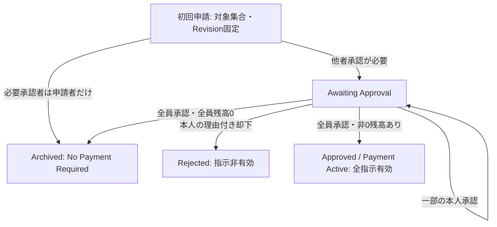

# 精算Caseの初回承認

- Status: Confirmed（初回申請・承認部分のみ）
- Source of Truth: [現行モデル Approval・Revision／No Payment Required](../product/current-model.md)、[ADR #152 Case Root](../adr/expense-settlement-consistency-boundary.md)
- Related: [Task #160](https://github.com/takeshi-arihori/kakei_app/issues/160)、[内部契約](../domain/settlement-case-approval-contract.md)
- Last Confirmed: 2026-10-01

Caseが不変な初回Revisionと固定必要承認者への判断を所有する。申請者が必要承認者なら本人の承認だけを記録する。全員0円でも全員承認を必要とし、Payment Activeを経由しない。

必要承認者が1人だけなら支払と負担が同じ本人へ帰属するためBalanceは0。申請者以外の1人が必要承認者なら、その本人の判断をAwaiting Approvalで待つ。申請者やOwnerが他者の判断を代行する矢印は追加しない。

これは初回承認の部分図である。Rejectedからの再申請／Withdraw、Payment ActiveからのAttempt／受取／取消／完了Archiveは省略し、全Lifecycleを完成した図と扱わない。状態・内容の予約commit／保存／認可は後続Application契約であり、矢印は実DBの原子性を証明しない。正式Contextmapの3 ContextやOwnerを変更せず、ProposedなPort／Storageを描かない。
