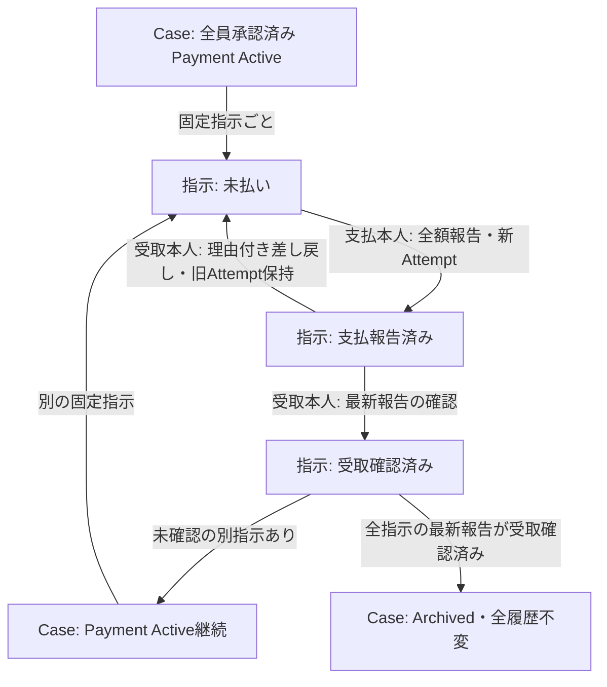

# 固定指示の支払報告・受取確認Lifecycle

- Status: Confirmed（Payment部分のみ、取消とApplication保存は省略）
- Source of Truth: [現行モデル 支払確認・再試行](../product/current-model.md)、[ADR #152 Case Root](../adr/expense-settlement-consistency-boundary.md)
- Related: [Task #164](https://github.com/takeshi-arihori/kakei_app/issues/164)、[内部契約](../domain/settlement-payment-attempt-contract.md)、[初回承認図](settlement-initial-approval.mermaid.md)
- Last Confirmed: 2026-10-01

各指示の支払相手・全額・ID、精算内容と対象Expense集合は固定する。差し戻しはApprovalの却下とは別で、同じInstructionへ新Attemptを追加する。既にReceivedの指示をUnpaidへ戻す遷移ではない。報告だけで精算全体は完了しない。No Payment Requiredは初回／再申請の全員承認から直接Archiveする別経路。

本人の実認証・過去Participant束縛、Group fence、Case版の先着保存・原子性・operation再送は後続Application契約。純Domainの状態遷移を実送金や保存成功の証拠にしない。Archive後は再開・取消・訂正しない。Groupの終了は別の明示操作で、精算完了から自動終了しない。
