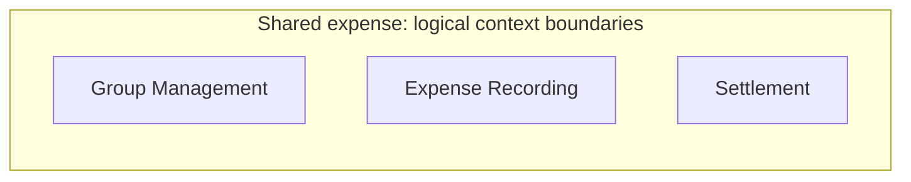

# 共有割り勘の論理Context境界

- Status: Confirmed（採用済み3 Contextの範囲のみ）
- Source of Truth: [共有割り勘の設計境界と永続化方針](../adr/shared-expense-domain-boundaries.md#decision)（Accepted、条件C1は充足済み）
- Related: [Task #31](https://github.com/takeshi-arihori/kakei_app/issues/31)、[ADR #24](https://github.com/takeshi-arihori/kakei_app/issues/24)
- Last Confirmed: 2026-09-20（C1充足証拠を同期。図の3 Context構造は変更なし）

## 図の目的と読み方

ADR #24のDecision 1で採用した3つの論理的なBounded Contextを示す。外枠は共有割り勘アプリの論理的な範囲を表す。内側の3つの箱は、それぞれ独立したContextであり、処理順序や物理的な配置を表さない。

Context間の方向、公開契約、依存関係は未決のため矢印を描いていない。矢印がないことは、Context同士が連携しないというDecisionを意味しない。接続契約まで確定したContext Mapは後続の設計対象とする。

## 採用方針との対応

| 表現 | 根拠と意味 |
| --- | --- |
| Group Management、Expense Recording、Settlementの3つの箱 | ADR #24 Decision 1の論理境界。この図は、ADR #35で条件付きAcceptedとなったGroup ManagementのData Owner／Group Aggregateを含め、個別配置を表さない |
| Shared expenseの外枠 | [現行Product Scope](../product/current-model.md)の共有割り勘アプリ。DeploymentやDatabaseの境界ではない |
| 物理配置を描かない | ADR #24 Decision 2はMVPでModular Monolithを許容する。3 Contextは3 Microserviceの採用を意味しない |

## 未決事項と実装Gate

ADR #35／#36で条件付きAcceptedとなったGroup Management初回境界を除き、Categoryの所属、他ContextのData Owner／Aggregate境界、Context間Port、Expense予約・競合のTransaction方式、非同期Projectionは未決であり、この図では採用しない。Group ManagementのRepository Portは[ADR #35](../adr/group-management-consistency-boundary.md)を正本とする。

条件C1はOwner Accepted、独立Security Review pass、PR #70のdevelop統合により充足した。依存Persistence実装TaskはC1だけでReadyにせず、S0〜S3とTask固有Gateを満たすまでBacklog／Blocked Yesとする。詳細は[ADRの条件C1](../adr/shared-expense-domain-boundaries.md#承認条件-c1-snapshot-revisionの保護と保存)と[設計Gate](../product/design-gates.md)で追跡する。

文章のAccepted Decisionを図より優先する。[図の管理ルール](../engineering/diagram-governance.md)に従い、draw.ioを参照・変更・自動変換せず、Accepted ADRから作成した。
